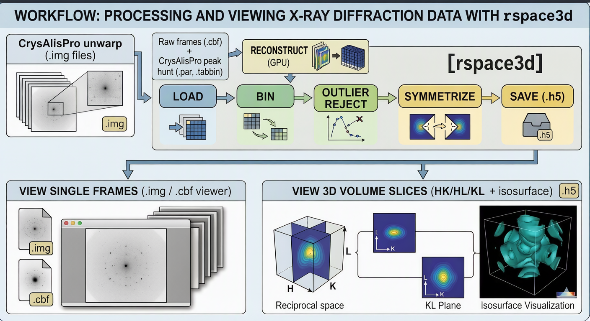
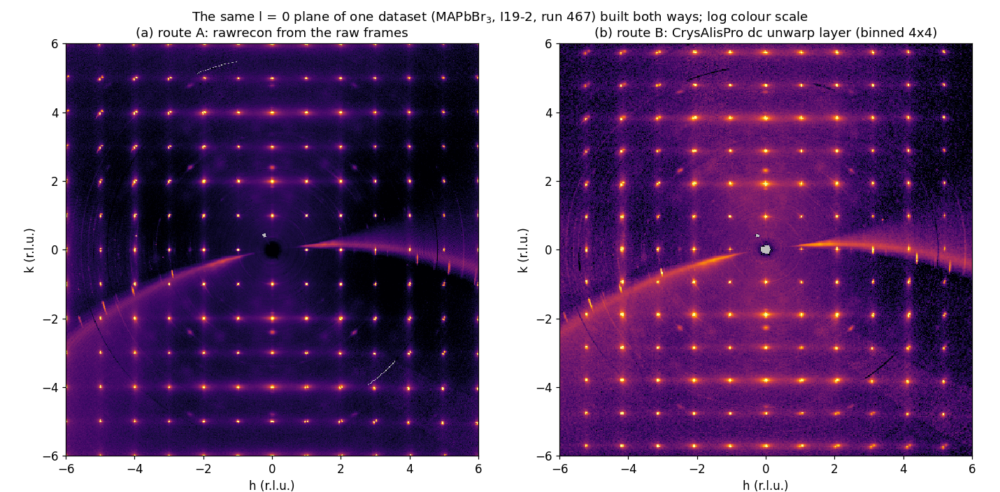
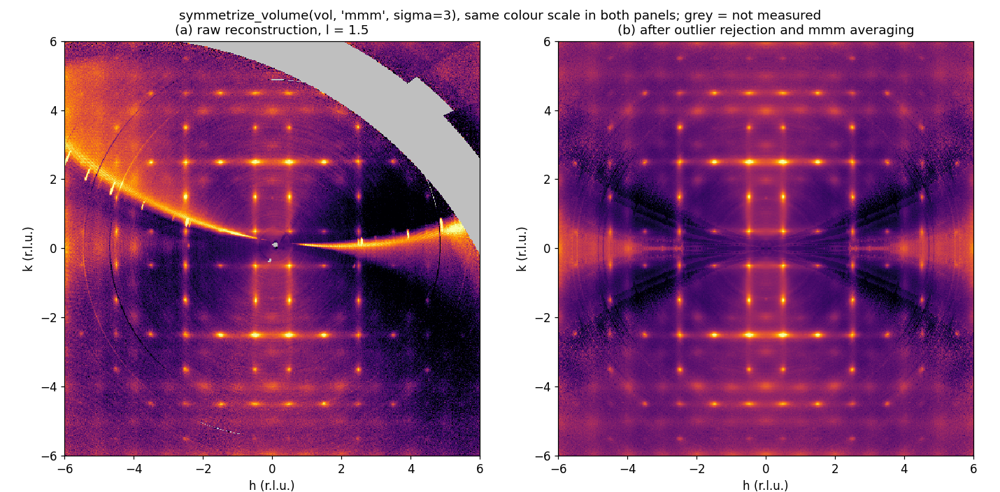

# rspace3d


Reciprocal-space 3D processing for single-crystal X-ray diffuse scattering
measured as a rotation scan on a flat area detector and processed in
[CrysAlisPro](https://rigaku.com/products/crystallography/x-ray-diffraction/crysalispro).

rspace3d turns a CrysAlisPro experiment into a 3D volume on a regular
(h, k, l) grid, cleans it with symmetry averaging and outlier rejection, and
lets you inspect it. It builds the volume directly from the raw detector
frames: the UB matrix comes from CrysAlisPro's `_cracker.par`, the detector
geometry, the rotation axis and the crystal orientation are fitted to
CrysAlisPro's peak-hunt table (`_peakhunt.tabbin`), and every pixel of every
frame is then mapped to (h, k, l) and accumulated on the GPU. A full scan is
reconstructed in about half a minute, whereas assembling the same volume from
CrysAlisPro's `dc unwarp` layers takes hours. Volumes built from `dc unwarp`
layers are supported as well.


## Contents

- [Two routes to a volume](#two-routes-to-a-volume)
- [Speed](#speed)
- [Installation](#installation)
- [Route A: reconstruction from the raw frames](#route-a-reconstruction-from-the-raw-frames)
- [Route B: volume from CrysAlisPro unwarp layers](#route-b-volume-from-crysalispro-unwarp-layers)
- [Symmetrisation and outlier rejection](#symmetrisation-and-outlier-rejection)
- [Viewing volumes](#viewing-volumes)
- [Python API summary](#python-api-summary)
- [HDF5 output format](#hdf5-output-format)
- [Laue groups](#laue-groups)
- [How the hkl grid is computed for .img layers](#how-the-hkl-grid-is-computed-for-img-layers)
- [Citing](#citing) and [License](#license)

## Two routes to a volume



- **Route A, reconstruction from the raw frames** (`rspace3d.rawrecon`; GUI
  `rspace3d-reconstruct`). Inputs are the raw `.cbf` frames, the
  `<exp>_cracker.par` and the `<exp>_peakhunt.tabbin` of the experiment. No
  `dc unwarp` step is needed.
- **Route B, assembly of CrysAlisPro `dc unwarp` layers** (`.img` files; GUI
  `rspace3d-builder`, command line `rspace3d-process`).

Both routes write the same HDF5 format and share the binning, symmetrisation,
viewer and Python API. The reverse operation, projecting a volume back onto an
area detector at any diffractometer setting, is done by
[xrays-on-detector](https://github.com/dubajicmilos/xrays-on-detector).



*The l = 0 plane of one dataset (MAPbBr₃, I19-2) built by both
routes: (a) from the raw frames with rawrecon, (b) CrysAlisPro's `dc unwarp`
layer, binned 4 × 4 to a similar voxel size. Both show the same Bragg peaks,
diffuse streaks and arcs. Each panel has its own log colour scale, because the
two volumes are on different intensity scales.*

## Speed

Measured on one NVIDIA RTX 3090 for the dataset in the figure above: 1735 frames of
2068 × 2162 pixels, reconstructed onto a 480 × 480 × 480 grid (h, k and l from
-6 to 6 at 0.025 r.l.u.).

| Step | Time |
|---|---|
| Geometry fit from the peak-hunt table | about 4 s |
| Accumulation of all 1735 frames on the GPU | 34 s (about 20 ms per frame) |
| The same accumulation on the CPU | about 1 s per frame, about 30 min in total |
| Outlier rejection and mmm averaging of the 480³ volume on the GPU | about 3 s |
| The same volume through CrysAlisPro `dc unwarp` (601 layers, route B) | hours |

## Installation

Requirements: Python 3.10 or newer.

```bash
git clone https://github.com/dubajicmilos/rspace3d.git
cd rspace3d
pip install -e .
```

This installs the dependencies (numpy, scipy, fabio, h5py, matplotlib, PyQt6)
and these commands:

| Command | What it does |
|---|---|
| `rspace3d-reconstruct` | route A: GUI for reconstruction from the raw frames |
| `rspace3d-builder` | route B: GUI that builds a volume from `dc unwarp` layers |
| `rspace3d-process` | route B from the command line |
| `rspace3d-viewer` | viewer for `.h5` volumes, `.img` layers and `.cbf` frames |
| `python -m rspace3d.make_dcunwarp` | writes CrysAlisPro `.dcunwarp` layer lists for route B |

Each command can also be run as `python -m rspace3d.<module>`.

GPU acceleration, strongly recommended for route A, needs an NVIDIA GPU and
CuPy:

```bash
pip install cupy-cuda12x      # CUDA 12 driver; use cupy-cuda11x for CUDA 11
```

CuPy is detected automatically; without it everything runs on the CPU. Optional
3D isosurface backends: `pip install pyvista` or `pip install plotly`.

### Updating

```bash
pip install --upgrade git+https://github.com/dubajicmilos/rspace3d.git
```

This pulls the latest `main` and replaces the installed version. If you
installed from a local clone with `pip install -e .`, run `git pull` inside
the clone instead; the changes take effect immediately.

### Try it on the example volume

`example_data/example_monoclinic.h5` is a small processed volume of a
monoclinic 2D halide perovskite measured at I19, Diamond Light Source, at 250 K
(binned 4 × 4):

```bash
python -c "import rspace3d, rspace3d.rawrecon; print(rspace3d.__version__)"
rspace3d-viewer example_data/example_monoclinic.h5
```

In the viewer, switch between the HK, HL and KL planes, step through slices,
tick *Grid* for the Miller-index overlay, and try the line-profile tool and
*3D Isosurface...*.

## Route A: reconstruction from the raw frames

The geometry fit, the peak-hunt file format and the intensity corrections are
described in [`rspace3d/rawrecon/README.md`](rspace3d/rawrecon/README.md).

### What you need

One folder, normally the CrysAlisPro experiment folder, containing:

| File | Purpose | Required |
|------|---------|----------|
| `<stem>_0001.cbf`, `<stem>_0002.cbf`, ... | the raw rotation frames (Dectris miniCBF as written by Eiger and Pilatus detectors). Intensities, wavelength, pixel size, header distance and beam centre, and the goniometer `Phi` / `Angle_increment` are read from them. | yes |
| `<exp>_cracker.par` | the refined UB matrix (unit cell and orientation) and the wavelength | yes |
| `<exp>_peakhunt.tabbin` | CrysAlisPro's peak-hunt table: indexed reflections with pixel position, frame number and reciprocal vector. The geometry fit uses it as ground truth. | yes (recommended path) |

CrysAlisPro writes the `.par` and `.tabbin` files into the experiment folder
when you run **peak hunting** and then **find and refine the unit cell**
(Lattice wizard). Run the unit-cell step after the peak hunt, so that the peak
table is indexed with the same UB matrix that ends up in the `_cracker.par`.
Use the `_cracker.par`, not the plain `<exp>_0.par`: the plain file may hold an
automatically reduced cell that does not index the frames.

Notes on file discovery:

- Frames are found by file name, not by folder name. Files named
  `<prefix><number>.cbf` are grouped by prefix and the largest group is used
  (sub-folders such as `bup/` or `tmp/` are ignored).
- If the `.par` sits in a sub-folder, tick *Search subfolders for the .par file*
  in the GUI or pass `par_path=` in the API.
- The CBF headers must carry `Angle_increment` and `Phi` (standard in miniCBF).
  The scan may be a phi or an omega scan: the rotation axis and its sense are
  fitted from the peak table, and the header angle is used only as a datum.

### Using the GUI

```bash
rspace3d-reconstruct          # or: python -m rspace3d.reconstruct_gui
```

1. **Dataset folder.** Click *Browse...* and select the folder. The GUI reports
   the number of frames, detector size, wavelength, header distance, phi range
   and the unit cell read from the `.par`. If it reports that no `.par` was
   found, tick *Search subfolders for the .par file*.

2. **Reconstruction grid.** Set the `h`, `k` and `l` minimum and maximum in
   reciprocal-lattice units (they need not be symmetric or equal) and the voxel
   size `dq` (default 0.025 r.l.u.). The *Grid* line shows the voxel count and
   the GPU memory needed during accumulation (12 bytes per voxel), and turns red
   when this approaches the free VRAM. A 480 × 480 × 480 grid (-6 to 6 at 0.025)
   needs about 1.3 GB.
   - *frames (0 = all)*: use fewer frames for a quick test.
   - *hot-pixel clip*: pixels with counts above this value are ignored. The
     default (0 = off) keeps every pixel. A value such as 1e6 removes zingers
     but also clips saturated Bragg maxima on detectors that count above it
     (the Eiger at I19-2 reaches about 1.3e6 in Bragg cores).

3. **Options.**
   - *Solid-angle + polarisation corrections* (on by default), with the
     polarisation fraction (0.95 for a synchrotron, 0.5 for an unpolarised
     source). The Lorentz factor is applied implicitly by the per-voxel
     normalisation.
   - *Use GPU (CuPy)*: untick to force the CPU path.
   - *Geometry from CrysAlisPro tabbin*: leave this ticked. It fits the full
     geometry from the peak table. Unticking it falls back to indexing frame 1
     with the header geometry, which works only for clean datasets with a
     correct header and a vertical rotation axis.

4. **Reconstruct.** The log shows the geometry fit (which pixel convention was
   chosen, how many peaks indexed cleanly, the fit residual in Å⁻¹, the
   self-check in r.l.u.), the unit cell, the progress per frame, the run time
   and the fraction of voxels that received at least one pixel.

5. **Process the reconstructed volume** (enabled after a reconstruction):
   - *Save raw volume* writes `<folder name>_recon_raw.h5`. Unmeasured voxels
     are stored as `NaN`; measured voxels with zero counts are `0.0`.
   - *Symmetrise + Save* applies optional binning (H, K and L factors) and then
     one pass of symmetry averaging with outlier rejection in the chosen Laue
     group and sigma, and writes `<folder name>_recon_sym_<laue>.h5` (for
     example `_recon_sym_mbar3m.h5` for `m-3m`).
   - *Open in Viewer* saves the raw volume next to the frames and opens it in
     the viewer.

### Using the Python API

```python
from rspace3d import rawrecon
from rspace3d.volume_builder import bin_volume, symmetrize_volume, save_volume_h5

folder = "path/to/experiment"      # .cbf frames + <exp>_cracker.par + <exp>_peakhunt.tabbin

# Geometry from the peak table + reconstruction (GPU if CuPy is available).
vol, info = rawrecon.reconstruct_dataset(
    folder,
    ranges=((-6, 6), (-6, 6), (-6, 6)),   # h, k, l ranges in rlu
    step=0.025,                           # voxel size in rlu
    corrections=True,                     # solid angle + polarisation (E perpendicular to osc axis)
    hot=None,                             # ignore counts above this; None = keep all
    use_tabbin=True,                      # fit geometry from the tabbin (default is False)
    log=print)                            # progress lines

print(info["index_rms"], info["geom_hkl_dev"], info["measured_voxels"])
print("Bragg registration RMS (rlu):", rawrecon.bragg_registration_rms(vol))

# vol.data is (nh, nk, nl) float32 with NaN where unmeasured; vol.H/K/L are the axes.
vd = rawrecon.reconstruct_to_volumedata(vol, source_folder=folder)
save_volume_h5("sample_recon_raw.h5", vd)

vd2 = bin_volume(vd, 2, 2, 2)                       # optional
sym = symmetrize_volume(vd2, "m-3m", sigma=3.0)     # sigma=None: no outlier rejection
save_volume_h5("sample_recon_sym_mbar3m.h5", sym)
```

Other entry points: `rawrecon.geometry_from_tabbin(folder)` returns the fitted
`FittedGeometry` (detector, UB, R0, oscillation axis, sense, residuals);
`rawrecon.reconstruct_volume_gpu` and `rawrecon.reconstruct_volume` are the
accumulation engines if you want to supply your own geometry; and
`rawrecon.read_tabbin(path)` parses a peak-hunt table. The API table in
`rspace3d/rawrecon/README.md` lists everything.

Assumptions: flat detector at 2θ = 0, single-axis rotation scan,
monochromatic beam. Multi-axis scans and curved detectors are not supported.

### Checking the result

In the log:

- *best fit rms* is the residual of the geometry fit over the peak table, in
  Å⁻¹. Values around 0.001 to 0.002 Å⁻¹ are typical of a good fit.
- *validation: tabbin peaks -> integer hkl, median dev* should be a few
  hundredths of an r.l.u. Above 0.1 r.l.u. the run is aborted.
- *Bragg registration RMS* is the distance of the 300 brightest well-measured
  voxels from the nearest integer node. A value below the voxel size (0.025)
  means that the volume is registered to the lattice. Strong powder rings from
  the sample environment (bright, non-integer positions) can inflate this
  number, so check by eye as well.
- *measured ... voxels (xx%)* is the fraction of the grid covered by the scan.

Then open the volume in the viewer, switch on the Miller-index grid and step
through a few `l` planes: Bragg peaks must sit on the grid intersections in all
three plane orientations. Smeared or doubled peaks mean that the geometry is
wrong (see the troubleshooting table).

### Troubleshooting

| Message or symptom | Cause and fix |
|-------------------|---------------|
| `no CrysAlisPro .par file found` | the `.par` is not in the selected folder; tick *Search subfolders* or pass `par_path=`. |
| `need a *_cracker.par and a *_peakhunt.tabbin` | no peak-hunt table in the folder; run peak hunting in CrysAlisPro (a table named `*process_action*` is ignored on purpose). |
| `only N cleanly-indexed tabbin peaks; cannot calibrate` | the peak table is not indexed with the UB in the `.par`; redo unit-cell finding and refinement after the peak hunt, or point to the `.par` that belongs to this peak hunt. |
| `tabbin geometry fit failed self-check` | the fit did not converge: check that the `.cbf` frames in the folder are the scan that the peak hunt was run on (frame numbers in the table must match the file numbering), and that the experiment is a single-axis scan on a flat detector. |
| `could not reliably index ...` (tabbin option unticked) | the header-geometry path failed (powder rings, wrong header beam centre or distance); use the tabbin path. |
| GPU out of memory | shrink the grid (larger `dq` or narrower ranges); the *Grid* line shows the requirement. Or untick *Use GPU*. |
| peaks smeared, Bragg RMS around 0.5 r.l.u. | wrong detector pixel convention or geometry; see section 4.1 of `rspace3d/rawrecon/README.md`. |
| no GPU | the CPU path gives the same result at about 1 s per frame on a 480³ grid; use *frames* to test on a subset first, or a coarser `dq`. |

## Route B: volume from CrysAlisPro unwarp layers

In this route CrysAlisPro computes the reciprocal-space layers, and rspace3d
stacks them into a volume with a correct (h, k, l) grid taken from the UB
matrix in the `.par` file.

### Step 1: layer list

CrysAlisPro reconstructs one HK plane per `l` value with `dc unwarp`. Generate
the layer list with the *Generate dcunwarp file* section of the builder GUI
(`rspace3d-builder`; set the l range, for example -6 to 6, the step, 0.02, and
the resolution, 0.8 Å, then click *Generate*):


or from the command line:

```bash
python -m rspace3d.make_dcunwarp -6 6 0.02 0.8      # l_min l_max step resolution(A)
```

More than 500 layers are split into several files automatically (a CrysAlisPro
limit).

### Step 2: unwarp in CrysAlisPro

In the CrysAlisPro command line, run `dc unwarp` and load the `.dcunwarp` file
(once per file if several were generated):


This writes numbered `.img` files into an `unwarp/` folder.

### Step 3: build the volume

GUI:

```bash
rspace3d-builder                 # or: python -m rspace3d.volume_builder_gui
```

1. Browse to the `unwarp/` folder. The `*_cracker.par` (usually in the parent
   folder) is picked up automatically; it provides the UB matrix for the hkl
   grid.
2. Choose the Laue group (used for outlier rejection and symmetrisation).
3. Set the binning (2 × 2 recommended) and sigma (3.0; a higher value rejects
   less).
4. Click *Process All*. Output: `<sample>_raw.h5` and `<sample>_sym_<laue>.h5`.

Command line:

```bash
rspace3d-process path/to/unwarp --laue m-3m --sigma 3 --bin 2
```

`--sigma 0` skips outlier rejection, `--no-gpu` forces the CPU, and
`--workers 1` loads the files sequentially on machines with little RAM.

### How unmeasured pixels are handled

1. **Load and coverage mask.** Each `.img` layer is read as `int32`.
   CrysAlisPro marks bad pixels with `-1` and leaves large unmeasured regions
   (beamstop, panel gaps, Ewald-sphere gaps) at `0`, but `0` is also a valid low
   count. A morphological opening whose kernel scales with the Bragg spacing
   (`adaptive_morph_size`, by default about 5% of one Bragg cell) separates the
   two cases; unmeasured voxels become `NaN`.
2. **Binning.** Each block is averaged over its covered sub-pixels only, with
   the blocks aligned to the raster centre; an all-unmeasured block stays
   `NaN`.
3. **Symmetrisation and rejection in one pass**, as described in the next
   section.

Details and validation figures: [`docs/unwarp_processing.md`](docs/unwarp_processing.md).

## Symmetrisation and outlier rejection

Every voxel of a single-crystal volume has symmetry-equivalent positions under
the Laue group of the pattern: up to 48 for m-3m. `symmetrize_volume` gathers
the orbit of each voxel once, drops members that deviate from the orbit median
by more than sigma · max(1.4826 MAD, √max(median, 1)), provided that at least
`min_valid = 3` members are measured, and writes the NaN-aware mean of the
remaining members. An orbit with no measured member stays NaN. The same step
applies to volumes from either route.

Averaging over equivalent positions has three effects:

- regions that the scan did not reach are filled from measured equivalents
  (the grey area in panel a of the figure below);
- intensity that does not follow the lattice symmetry, such as zingers or the
  bright arc in panel a, is rejected as outliers (a complete powder ring is
  itself symmetric and survives, as the faint rings in panel b show);
- the noise decreases, because each voxel becomes the mean of several
  independent measurements.

The √max(median, 1) term keeps the rejection from clipping ordinary counting
noise in weak regions, which would otherwise bias weak diffuse intensity
downwards.



*The l = 1.5 plane of a volume reconstructed from 1735 raw frames of MAPbBr₃
at 230 K (I19-2, 0.025 r.l.u. voxels) before (a) and after (b)
`symmetrize_volume(vol, "mmm", sigma=3)`, on the same log colour scale. The
unmeasured fraction of the whole volume dropped from 6.5% to 0.3%. The dark
regions in (b) are weak diffuse intensity; in (a), the bright arc covered part
of them.*

Averaging imposes the symmetry you choose. Use the Laue group of the measured
diffraction pattern (for a twinned or multi-domain crystal, the group of the
domain-averaged pattern), and keep the raw volume for anything that tests for
symmetry breaking. All 11 Laue groups are supported (see [Laue groups](#laue-groups)).
Trigonal and hexagonal groups use the Miller-index operators, and on sheared
unwarp rasters (monoclinic or triclinic cells) the operations are applied by
interpolation.

## Viewing volumes

```bash
rspace3d-viewer path/to/volume.h5        # or: python -m rspace3d.rsp_viewer
```

The viewer opens `.h5` volumes from either route, single `.img` layers and raw
`.cbf` frames (display only). For volumes you can choose the plane (HK, HL,
KL), step through slices or integrate over a range, overlay the Miller-index
grid (tilted where the cell requires it, correct for all crystal systems), draw
line profiles, switch between linear and log colour scales, export images, and
open a 3D isosurface (*3D Isosurface...*, which needs Plotly or PyVista).

## Python API summary

```python
from rspace3d import (
    load_unwarp_folder, bin_volume, symmetrize_volume,
    save_volume_h5, load_volume_h5, extract_volume_slice, read_rsp_layer,
)
from rspace3d import rawrecon

vol = load_unwarp_folder("path/to/unwarp")          # route B: .img layers -> VolumeData
vol = bin_volume(vol, 2, 2, 1)
vol = symmetrize_volume(vol, "m-3m", sigma=3.0)     # sigma=None: pure symmetric average
save_volume_h5("output.h5", vol)

vol = load_volume_h5("output.h5")
sl, H, K, xl, yl, fl, fv, n = extract_volume_slice(vol, 0, target_val=0.0)   # HK plane at l=0

layer = read_rsp_layer("path/to/file.img")          # single layer with Miller grids
```

`VolumeData` holds `intensity[ih, ik, il]` (float32, `NaN` = unmeasured) in
physical (h, k, l) order, the 1D axes `H`, `K` and `L`, optional `counts`
(reconstructions) and `metadata` (unit cell, UB, wavelength, `grid_kind`, and
for unwarp rasters `M_inv`, the Cartesian step `s`, the centre `cx`/`cy` and
the binning). `volume_affine(vol)` returns the index-to-hkl map used by the
symmetry and slicing code.

## HDF5 output format

Datasets: `/data` (nh × nk × nl, float32, `NaN` = unmeasured), `/H`, `/K`,
`/L`, `/UB` (3 × 3, CrysAlisPro convention, includes the wavelength factor),
`/M_inv` (2 × 2, unwarp rasters) and `/counts` (reconstructions). Attributes:
`plane_type`, `grid_kind`, `wavelength`, `cell_a/b/c/alpha/beta/gamma`, `s`,
`cx`, `cy`, `bin_xy`, `bin_z`, `source_folder`, `source_manifest`,
`laue_group`, `sigma`, `min_valid`, `poisson_floor`, `n_outliers_removed`,
`symmetry_ops_applied`, `symmetry_mapping` and `symmetry_max_index_error`
(symmetrised volumes); the coverage-mask diagnostics of route B (`morph_size`,
`n_unmeasured_per_frame_*`, `frame_npix`); and the reconstruction provenance of
route A (`reconstructed_by`, `polarization_axis`, `hot_pixel_cutoff`,
`geometry_method`). The files can be read from MATLAB with
`h5read(file, '/data')` and similar calls.

## Laue groups

| Laue group | Crystal system | Ops |
|---|---|---|
| -1 | triclinic | 2 |
| 2/m | monoclinic | 4 |
| mmm | orthorhombic | 8 |
| 4/m | tetragonal | 8 |
| 4/mmm | tetragonal | 16 |
| -3 | trigonal | 6 |
| -3m | trigonal | 12 |
| 6/m | hexagonal | 12 |
| 6/mmm | hexagonal | 24 |
| m-3 | cubic | 24 |
| m-3m | cubic | 48 |

## How the hkl grid is computed for .img layers

Each `.img` layer stores the intensity on a Cartesian grid (Å⁻¹) together with
the UB matrix, `d_min`, the wavelength, the plane type and the fixed index. The
Miller-index grid is derived as

```
s  = 2 / (d_min * NX)                    # Cartesian step per pixel
cx = (NX + 1) // 2 + 0.5                 # grid centre (same for cy)
e_x = v1 / |v1|                          # v1, v2: raw reciprocal vectors of the plane
e_y = (v2 - (v2 . e_x) e_x) / |...|
M  = [[v1 . e_x, v2 . e_x], [v1 . e_y, v2 . e_y]];  M_inv = inv(M)
h = M_inv[0,0] * s * (i - cx) + M_inv[0,1] * s * (j - cy)
k = M_inv[1,0] * s * (i - cx) + M_inv[1,1] * s * (j - cy)
```

For non-orthogonal cells the cross terms matter: grid lines are tilted, and HL
or KL slices through an HK-stacked volume need cross-term interpolation.
rspace3d handles this automatically; the header layout is documented in
[`docs/CrysAlisPro_hkl_layer_format.md`](docs/CrysAlisPro_hkl_layer_format.md).

## Repository layout

```
rspace3d/
    README.md                   this file
    LICENSE                     GNU GPL v3
    CITATION.cff                citation metadata
    pyproject.toml              package metadata, dependencies, console scripts
    rspace3d/                   the Python package
        rawrecon/               route A: raw-frame reconstruction (with its own README.md)
        reconstruct_gui.py      route A: GUI
        volume_builder.py       load .img layers, bin, symmetrise, HDF5 I/O
        volume_builder_gui.py   route B: one-button GUI
        volume_process.py       route B: command line
        rsp_reader.py           read a single .img layer, Miller-index grid
        rsp_viewer.py           viewer for .img / .cbf / .h5
        volume_isosurface.py    3D isosurface (Plotly / PyVista)
        make_dcunwarp.py        write CrysAlisPro .dcunwarp layer lists
    tests/                      regression tests (python -m pytest tests)
    docs/                       .img header format, unwarp processing notes, figures
    notebooks/                  example analysis notebook
    example_data/               a small processed volume to try the viewer with
    build_exe.py                optional PyInstaller build of standalone executables
```

## Standalone executables (optional)

`python build_exe.py` (after `pip install pyinstaller`) builds single-file
Windows executables of the viewer, the builder GUI and the command-line
processor.

## Citing

If you use rspace3d in published work, please cite it. GitHub's *Cite this
repository* button (from [`CITATION.cff`](CITATION.cff)) gives the reference in
APA and BibTeX form.

## License

Copyright (C) 2025-2026 Miloš Dubajić.

From version 2.1.0, rspace3d is free software: you can redistribute it and/or
modify it under the terms of the GNU General Public License as published by
the Free Software Foundation, either version 3 of the License, or (at your
option) any later version. It is distributed WITHOUT ANY WARRANTY; see
`LICENSE` for the full text.

Releases up to and including 0.1.1 were published under the MIT License and
remain available under it.
