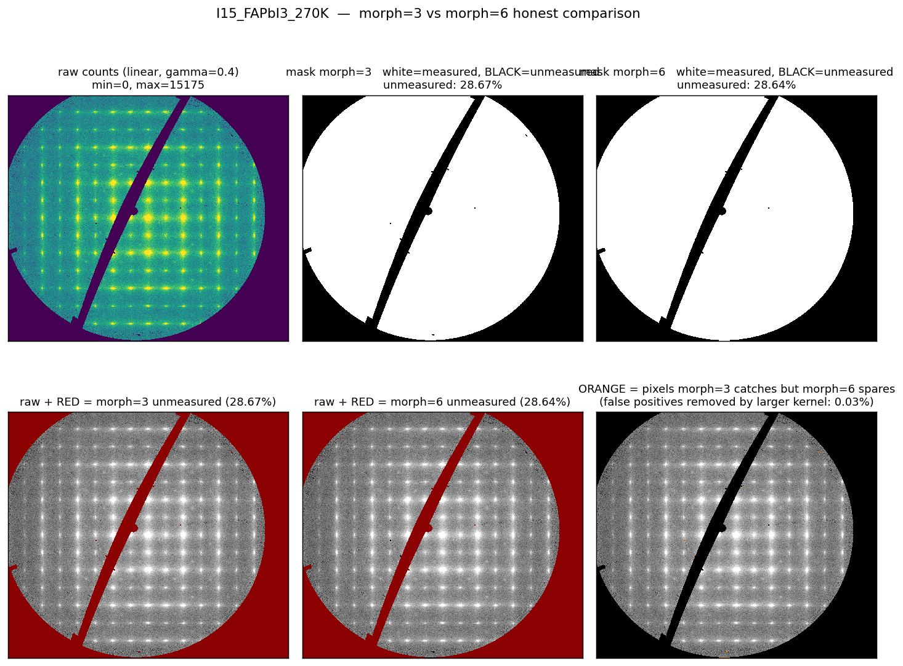
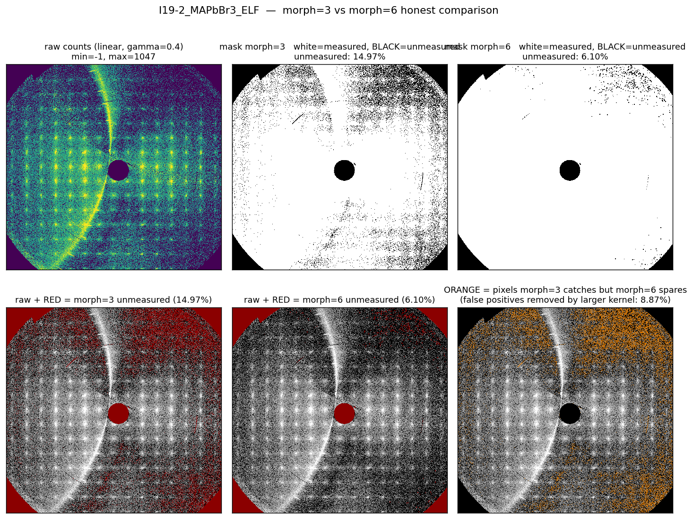
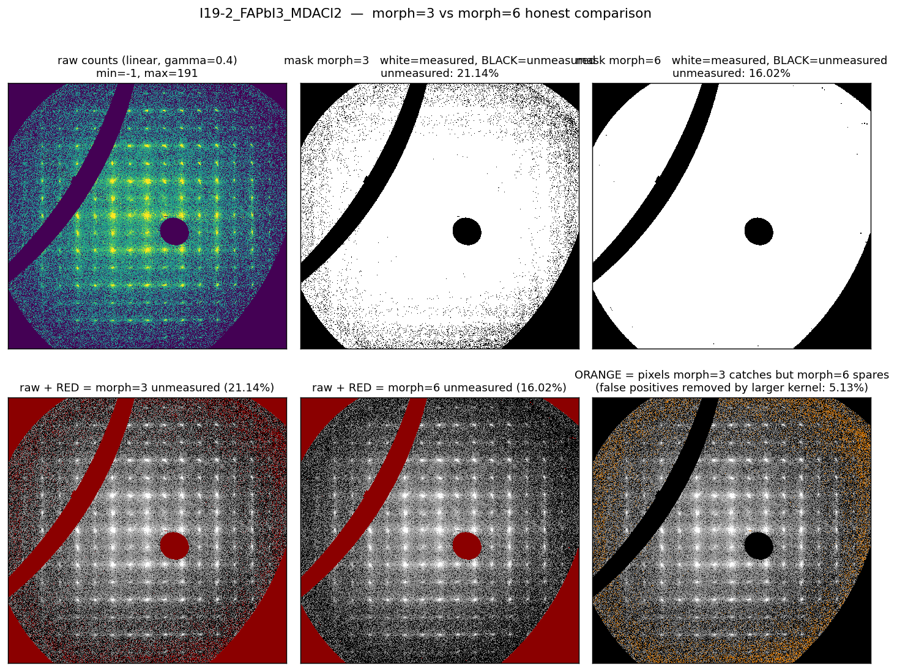
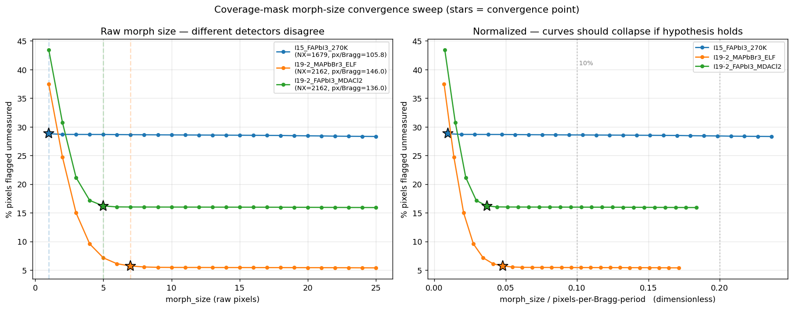

# Processing CrysAlisPro unwarp layers: coverage mask, binning and symmetrization

Route B builds a volume from CrysAlisPro `dc unwarp` layers (`.img` files). This
note describes how rspace3d separates unmeasured pixels from genuine zero counts,
how it bins the layers, and how it symmetrizes the volume and rejects outliers.
Throughout, "no measurement" and "a measurement of zero" are kept apart:
unmeasured pixels become `NaN`, and only measured values are averaged.

## 1. Per-frame coverage mask

CrysAlisPro `.img` files store unmeasured pixels as either `-1`
(detector-flagged bad pixel) or `0` (large dead region: beamstop, edge,
panel gap). However, `0` also occurs as a genuine low-count measurement in
quiet regions of diffuse scattering, so we cannot treat all zeros as
unmeasured.

`build_coverage_mask` resolves this with a morphological opening: any
`0` pixel that survives an N×N erosion followed by a dilation is treated as
unmeasured. The opening erases isolated zeros and thin lines of zeros, which
are therefore treated as real measurements.

```python
bad  = (raw == -1)
zero = (raw == 0)
unmeasured_zero = ndimage.binary_opening(zero, structure=ones((N, N)))
unmeasured = unmeasured_zero | bad
mask = ~unmeasured           # True = measured
```

The mask is applied at native detector resolution, before binning.
Unmeasured pixels become `NaN` in the float32 volume, and every later
operation (`bin_volume`, `symmetrize_volume`) uses NaN-aware reductions.

### Why the kernel size matters, and the dynamic-N formula

A fixed `N=3` kernel works on small detectors (e.g. I15 Pilatus3
1679×1475) but causes false positives on larger detectors (I19-2
2068×2162). On the larger detector, the same 3-pixel kernel covers half
as much reciprocal-space area, so it flags small clusters of low-count
zeros between Bragg peaks, although these are genuine measurements.

The kernel should therefore span a fixed fraction of one Bragg cell in
r.l.u. rather than a fixed number of pixels. The function
`adaptive_morph_size` implements this:

```python
def adaptive_morph_size(s_per_pixel, recip_period,
                        fraction_of_bragg=0.05, min_morph=3):
    """Kernel side length covers ~5% of one Bragg cell."""
    n = max(min_morph, int(np.ceil(fraction_of_bragg * recip_period / s_per_pixel)))
    return n if (n % 2) else n + 1   # force odd
```

`s_per_pixel = 2 / (d_min * NX)` is the Cartesian step per detector
pixel (1/Å), and `recip_period` is the in-plane reciprocal-vector
length, e.g. `mean(|a*|, |b*|)` for an HK plane. Both are computed from
the `.img` header. The kernel size therefore adapts to:

- the detector distance, which changes `d_min` and therefore `s_per_pixel`;
- the detector pixel count (`NX`);
- the unit-cell size: a large cell has a small `|a*|` and Bragg peaks
  packed closely in q, so the kernel shrinks proportionally and does not
  flag genuine quiet regions between weak Bragg peaks as unmeasured.

`load_unwarp_folder` resolves `morph_size='auto'` from the header once,
at load time. Pass an integer to override it.

### Validation: morph=3 vs morph=6 on three real datasets

The figures below show, for each dataset:

- top row: raw counts (linear gamma), then the `morph=3` and `morph=6`
  masks alone (white = measured, black = unmeasured);
- bottom row: raw counts with a red overlay where each mask marks pixels
  as unmeasured, plus a difference panel (orange = pixels that `morph=3`
  rejects but `morph=6` keeps as real low-count measurements).

I15 Pilatus3 (FAPbI₃, 1679×1475 px, 106 px/Bragg): the detector is clean,
and morph=3 and morph=6 give the same result because the dataset has
almost no isolated zero clusters.



I19-2 Eiger 2X 4M (MAPbBr₃ ELF, 2068×2162 px, 146 px/Bragg): morph=3 falsely
flags many pixels inside the diffuse pattern as unmeasured, and morph=6
removes these false positives. With morph=6, 8.87% of the frame moves from
"unmeasured" back to "measured".



I19-2 Eiger 2X 4M (FAPbI₃ MDACl₂, 2068×2162 px, 136 px/Bragg): the behaviour is
the same, and 5.13% of the frame is recovered.



### Convergence sweep

The default `fraction_of_bragg = 0.05` lies past the knee of the `%flagged`
curve, measured by sweeping morph_size from 1 to 25 on the three datasets:



Left panel: `%flagged vs morph_size` in raw pixels. The two I19-2
datasets, on the larger detector, converge around morph=5–7, whereas the
curve for the smaller I15 detector is flat from morph=1 because its zero
pixels already form large connected blocks. Right panel: the same data
with the x-axis normalized by pixels per Bragg cell. Convergence occurs at
fractions of 0.04–0.05, so the default of 0.05 is past the knee on all
three test datasets.

## 2. NaN-aware float-mean binning

`bin_volume` and the per-frame `bin_2d_covered` average only the covered (finite)
sub-pixels of each block, and the blocks are aligned to the raster centre so that
90° rotations and inversions remain exact index maps after binning. A block that
mixes NaN and finite values returns the mean of the finite values, and an all-NaN
block stays NaN. Real low-count pixels (for example a 1 or 2 in a 4×4 block of
zeros) are therefore kept rather than rounded down to zero.

## 3. Single-pass symmetrization and outlier rejection

For each voxel, `symmetrize_volume(vol, laue_group, sigma=...)` does the
following:

1. Gather the symmetry-equivalent orbit under the chosen Laue group.
2. Compute the orbit median and MAD, ignoring NaNs.
3. Flag orbit members that deviate from the median by more than
   `sigma * max(1.4826 * MAD, sqrt(max(median, 1)))` as outliers (they are
   set to NaN in the orbit buffer, not in the stored volume). The Poisson
   term keeps an orbit of tied low counts (MAD = 0) from rejecting ordinary
   counting noise.
4. Write the `nanmean` of the surviving orbit members to the output
   voxel. An orbit with no measured member stays NaN.

The `min_valid` guard (default 3) prevents outlier flagging on orbits
with too few finite measurements, for which the median itself is
unreliable.

Each voxel's orbit is gathered once, from the original data buffer, so
chunks cannot contaminate each other through symmetry and the result does
not depend on the order in which chunks are processed.

Pass `sigma=None` (Python API) or `--sigma 0` (CLI) to skip outlier
rejection and produce a pure symmetric average.

## Metadata written to the HDF5 file

Besides the `/data /H /K /L /M_inv /UB` datasets and the cell attributes,
the processed volume stores:

| Attribute | Meaning |
|---|---|
| `morph_size` | Resolved coverage-mask kernel side, in native pixels |
| `n_unmeasured_per_frame_mean` | Mean count of NaN voxels per loaded frame |
| `n_unmeasured_per_frame_min` | Min count of NaN voxels per loaded frame |
| `n_unmeasured_per_frame_max` | Max count of NaN voxels per loaded frame |
| `n_unmeasured_per_frame_pct` | Mean count as % of frame pixels |
| `frame_npix` | Pixels per frame (post-bin) |
| `laue_group` | Laue group used for symmetrization |

`symmetrize_volume` also records `sigma`, `min_valid`, `poisson_floor` and
`n_outliers_removed` (each rejected voxel counted once), and `save_volume_h5`
writes them to the HDF5 file together with the symmetry provenance
(`symmetry_ops_applied`, `symmetry_mapping`, `symmetry_max_index_error`).

During processing, the CLI banner and the GUI log report the actual coverage
rate and the resolved morph kernel for every run.
